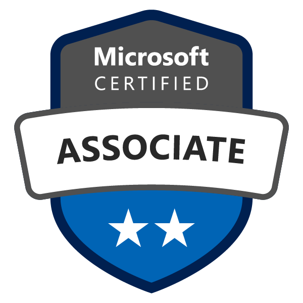

# Microsoft AZ-100 Study Guide 😎

AZ-100 **Microsoft Azure Infrastructure and Deployment** Certification *personal* Study Guide.

# About 📌

AZ-100 certification is 1 of 2 required certifications to aquire the title,

> Microsoft Certified - Azure Administrator Associate

Here is the [Link](https://www.microsoft.com/en-us/learning/azure-administrator.aspx) for more detail about the title.

### Cost:

- **$165.00 USD**
- Pricing can differ if you live in a different country other than `US` and/or if you are currently a `student`.

### Exam Score Distributions:

- Manage Azure subscriptions and resources **(15-20%)**
- Implement and manage storage **(20-25%)**
- Deploy and manage virtual machines (VMs) **(20-25%)**
- Configure and manage virtual networks **(20-25%)**
- Manage identities **(15-20%)**

Here is the [Link](https://www.microsoft.com/en-us/learning/exam-az-100.aspx) for more detail about the `AZ-100` certification.

# Overview 🏔

This exam `AZ-100` will prepare Candidates for this exam are Azure Administrators who manage cloud services that span storage, security, networking, and compute cloud capabilities.

Candidates have a deep understanding of each service across the full IT lifecycle, and take requests for infrastructure services, applications, and environments.

They make recommendations on services to use for optimal performance and scale, as well as provision, size, monitor, and adjust resources as appropriate.

Following lists are specific topics this **particular exam** will cover.

1. Manage Azure Subscriotions and resources.

2. Implement and manage storage.

3. Deploy and manage virtual machines (VMs).

4. Configure and manage virtual networks.

5. Manage identities.

> We will dive each topics indepth later here.

# Useful Links ⛓

Following are the list of useful links associated with this exam.

- [Azure Portal](https://portal.azure.com).
  - Main Azure landing portal page.
- [Azure Sign Up details](https://azure.microsoft.com/en-us/pricing/).
  - Info regarding Sign Up with Azure to get started.
- [Azure Status Check](https://azure.microsoft.com/en-us/status/).
  - Check Azure status across different regions.
- [Azure HandsOn Labs](https://www.microsoft.com/handsonlabs).
  - Able to virtually create azure web environment for different type of labs.
- [Azure List of All Exams](https://www.microsoft.com/en-us/learning/azure-exams.aspx).
  - See all list of exams offered by Microsoft.
- [Azure Official Documentations](https://docs.microsoft.com/en-us/azure/).
  - Official Documentations on Azure products.
- [Azure Fundmental e-Learning Path](https://docs.microsoft.com/en-us/learn/paths/azure-fundamentals/).
  - Great learning path with tutorials provided by MS.

# Study Guide 📝

Now, let's talk about each topics that are required on the exam.

## 🍏 Manage Azure Subscriotions and resources (15-20%)

- **Manage Azure subscriptions**
  > May include but not limited to: Assign administrator permissions; configure cost center quotas and tagging; configure Azure subscription policies at Azure subscription level

  - **Assign administrator permissions**
    - Read [Azure Document](https://docs.microsoft.com/en-us/azure/active-directory/users-groups-roles/directory-assign-admin-roles) for more details.

    - To add more **admin user**: On the Azure portal, just Click `All services` -> `Subscriptions` -> Click on any `Subscription` -> `Access control (IAM)` -> `Add role assignment`.

      - Just chose the correct Role, Access Target, and User in the form to finish adding a admin.

    - Or `Azure Active Directory` -> `Roles and administrators` -> Click any `Role` -> `Add Member` to add users to a specific role.

  - **Configure cost center quotas and tagging**
    - Read [Cost center Quota](https://docs.microsoft.com/en-us/azure/billing/billing-getting-started#ways-to-monitor-your-costs-when-using-azure-services) for more details.

    - Read [Tags](https://docs.microsoft.com/en-us/azure/azure-resource-manager/resource-group-using-tags) for more details.

    - To check the **cost quota**: On the azure portal, just click `All services` -> `Subscriptions` -> Click on any `Subscription` -> `Cost analysis`.
      - You can filter by different properties like tags, resource type, resource group, and timespan.

    - *Tags* are basically a **key :: value** pair that can be used to categorize your resources in your custom flavor.

    - You can set **tags** on resource creations([Not all](https://docs.microsoft.com/en-us/azure/azure-resource-manager/tag-support)), and also can be enforced by attaching *Policy* to resource group or subscription to force new resources to have tags on creation.

  - **Configure Azure subscription policies at Azure subscription level**
    - Read [Create and Manage Policy](https://docs.microsoft.com/en-us/azure/governance/policy/tutorials/create-and-manage) for more details.

    - Understanding how to create and manage policies in Azure is important for staying compliant with your corporate standards and service level agreements. You can also gain a huge benefit of being able to **enforce a condition for resources** you create in the future.

    - To **assign policy**: On the azure portal, just click `All services` -> `Policy` -> `Assignments` on the left nav -> `Assign Policy` -> Scope it to a subscription then create assignment by filling up details.

- **Analyze resource utilization and consumption**
  > May include but not limited to: Configure diagnostic settings on resources; create baseline for resources; create and test alerts; analyze alerts across subscription; analyze metrics across subscription; create action groups; monitor for unused resources; monitor spend; report on spend; utilize Log Search query functions; view alerts in Log Analytics.

- **Manage resource groups**
  > May include but not limited to: Use Azure policies for resource groups; configure resource locks; configure resource policies; implement and set tagging on resource groups; move resources across resource groups; remove resource groups
